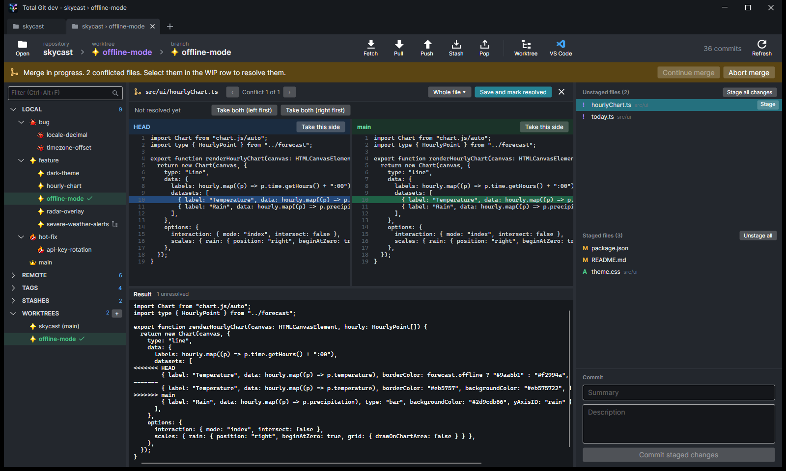
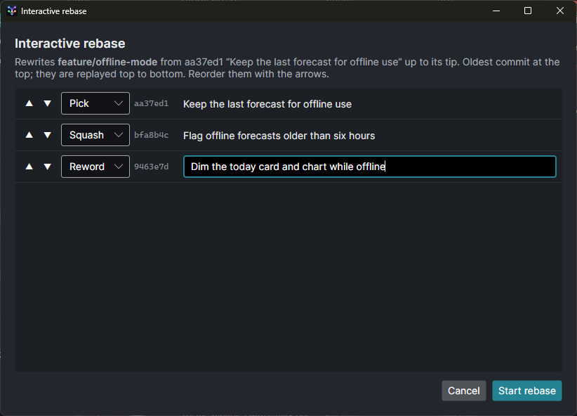
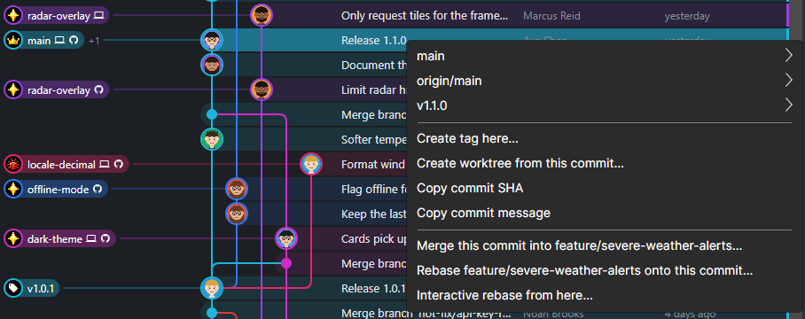

<h1 align="center">
  
</h1>

A visual git client for Windows, built with .NET and Avalonia.


## Features

- **Commit graph** with coloured lanes, author avatars, branch/tag pills and resizable columns.
  `feature/`, `bug/` and `hot-fix/` branches get an icon instead of the prefix; `main` gets a crown.
- **Sidebar** of local and remote branches, tags, stashes and worktrees, with ahead/behind counts and a
  ✕ on branches whose remote branch has been deleted.
- **Tabs** for several repositories or worktrees at once, restored when you reopen the app.
- **Diffs** inline or side by side, for commits and for uncommitted changes.
- **Staging and commit**, fetch, pull and push.
- **Merge and rebase** from the right-click menu, including rebasing onto any commit and
  **interactive rebase** (reorder, reword, squash, fix up or drop commits).
- **Built-in 3-pane merge tool** for conflicts, with continue / skip / abort for merges and rebases in progress.
- **Stashes** and **tags** (annotated or lightweight, push and delete).
- **Worktrees** under `.worktrees/<name>`, opened in a tab or in VS Code.

| Side-by-side diff | Staging and commit |
| --- | --- |
|  |  |

| Resolving a merge conflict | Interactive rebase |
| --- | --- |
|  |  |

Right-click a commit, branch or tag for tags, worktrees, merge and rebase:



<sub>Screenshots use a made-up demo repository and people.</sub>

## Install

Download **`TotalGitApp-win-Setup.exe`** from the [latest release](https://github.com/paulepath/total-git/releases/latest)
and run it. It installs for the current user (no admin) and adds a Start-menu shortcut.

The build isn't code-signed yet, so on first install Windows SmartScreen may show
"Windows protected your PC" — choose **More info → Run anyway**.

Requires [git](https://git-scm.com/) on `PATH` (used for commits, fetch/pull/push, merge, rebase, stash, tags and worktrees).

## Updates

Every push to `master` is built by GitHub Actions and published as a release (`v0.3.<run>`).
The installed app checks for a new release at start-up and every few hours, downloads it in the
background, and shows an **Update** button — restart to apply it, or it's applied when you next close the app.

## Build from source

```
dotnet build
dotnet test
dotnet run --project src/TotalGit.App -- <path to a repository>
```
