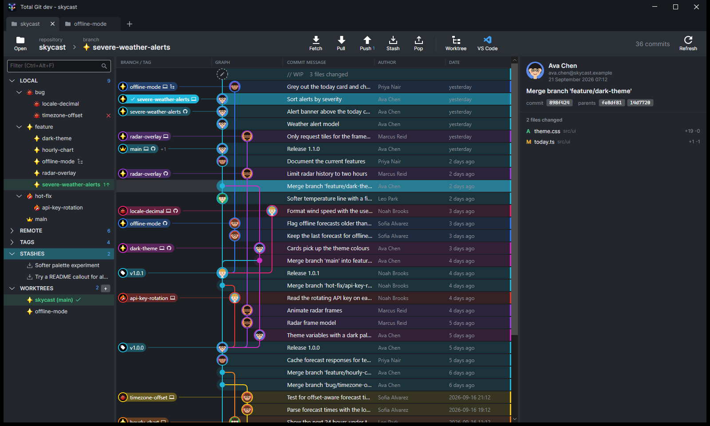
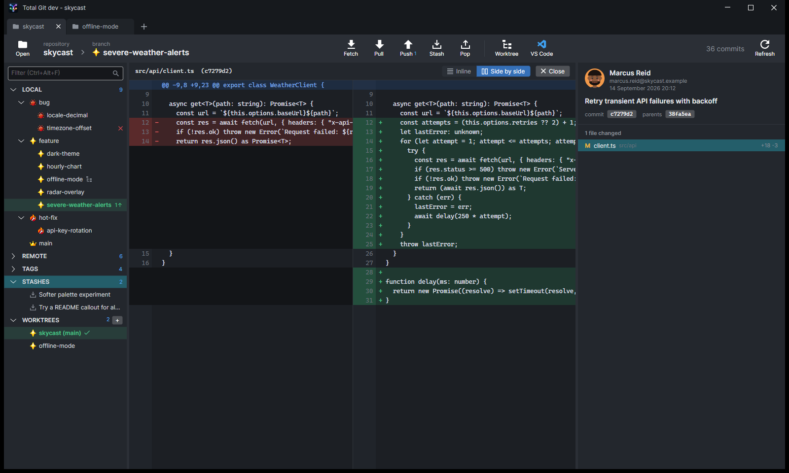
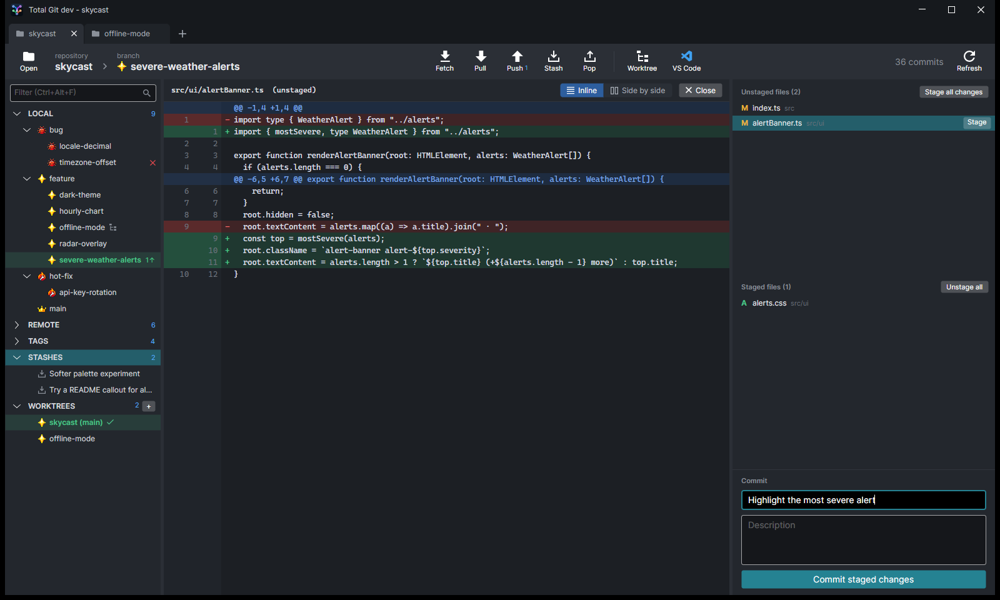

<h1 align="center">
  
</h1>

A visual git client for Windows, built with .NET and Avalonia: a commit graph with coloured
lanes and avatars, branch/tag/worktree sidebar, commit details with inline or side-by-side diffs,
staging and commit, fetch/pull/push, merge and rebase (including interactive rebase) with a built-in
3-pane merge tool, stashes, tags, and `.worktrees/<name>` worktree management with VS Code launch.



| Side-by-side diff | Staging and commit |
| --- | --- |
|  |  |

<sub>Screenshots use a made-up demo repository and people.</sub>

## Install

Download **`TotalGitApp-win-Setup.exe`** from the [latest release](https://github.com/paulepath/total-git/releases/latest)
and run it. It installs for the current user (no admin) and adds a Start-menu shortcut.

The build isn't code-signed yet, so on first install Windows SmartScreen may show
"Windows protected your PC" — choose **More info → Run anyway**.

Requires [git](https://git-scm.com/) on `PATH` (used for commit, fetch, pull, push and worktrees).

## Updates

Every push to `master` is built by GitHub Actions and published as a release (`v0.3.<run>`).
The installed app checks for a new release at start-up and every few hours, downloads it in the
background, and shows an **Update** button — restart to apply it, or it's applied when you next close the app.

## Build from source

```
dotnet build
dotnet test
dotnet run --project src/TotalGit.App -- <path to a repository>
```
