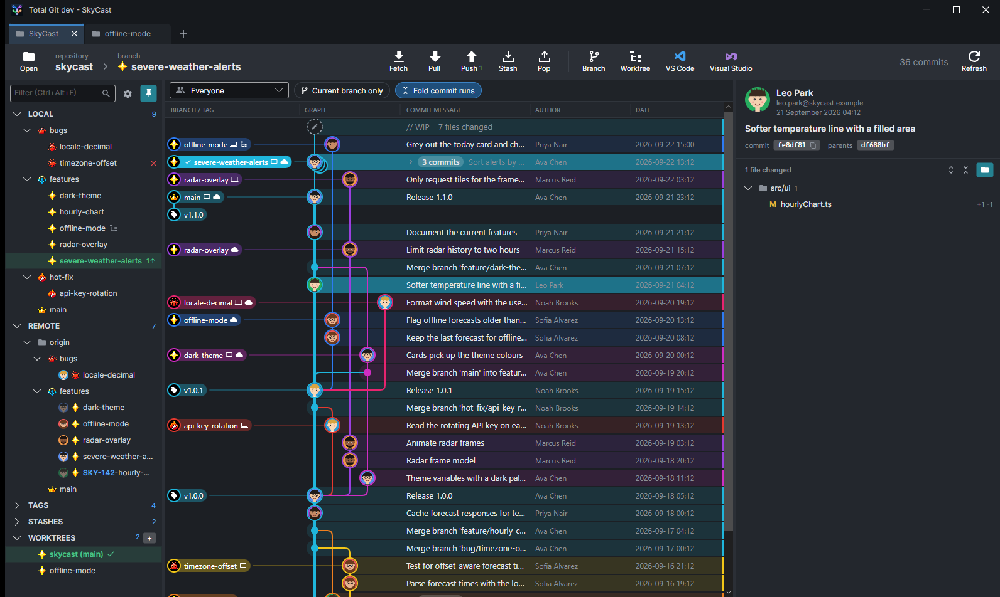
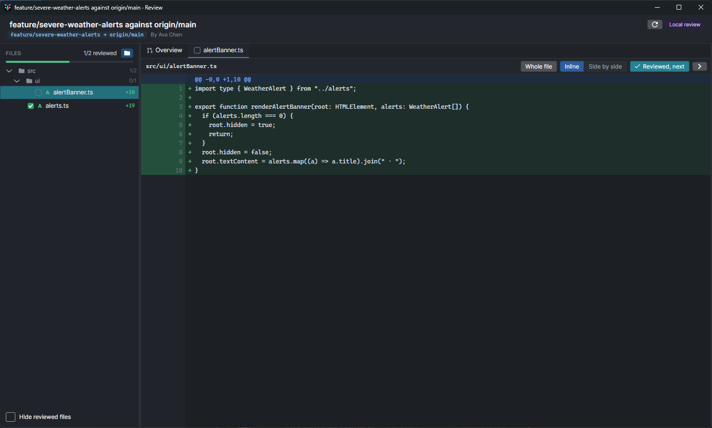
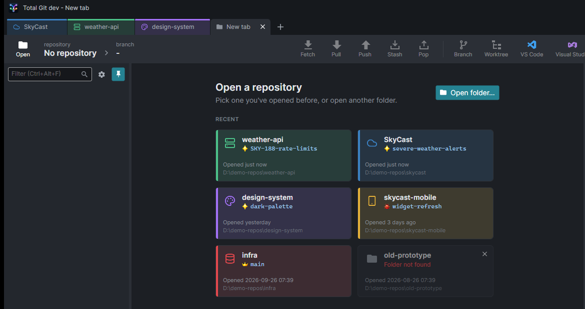
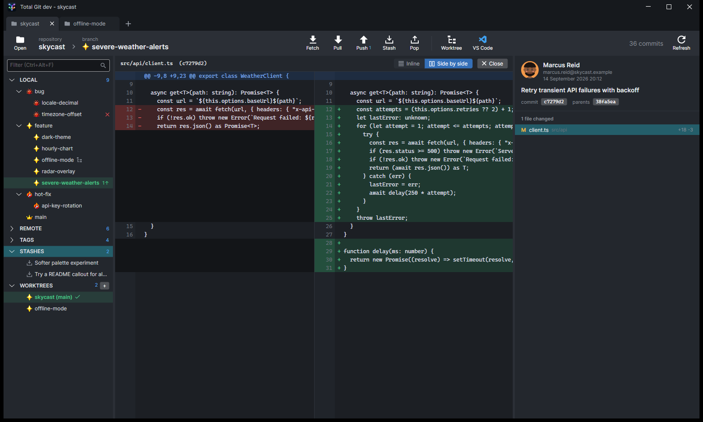
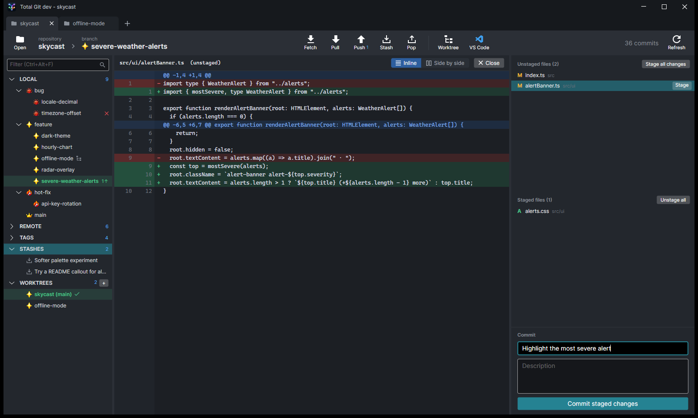
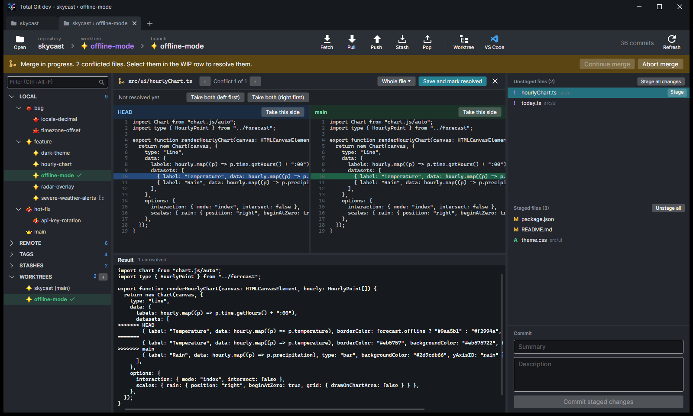
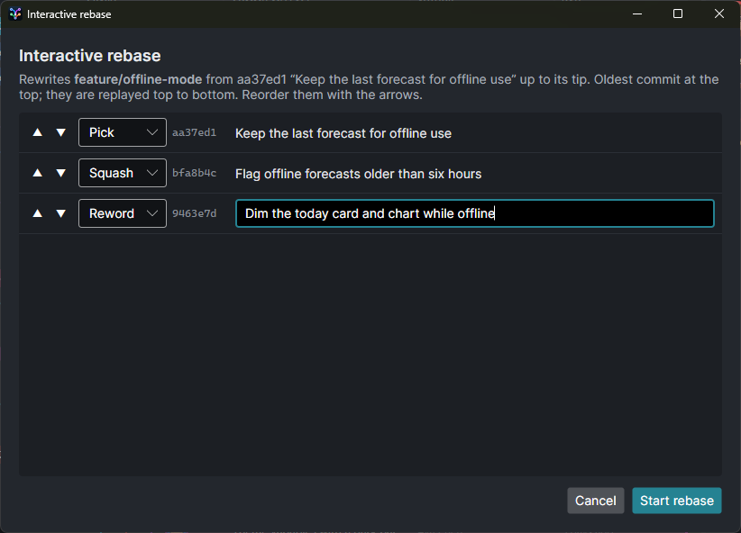
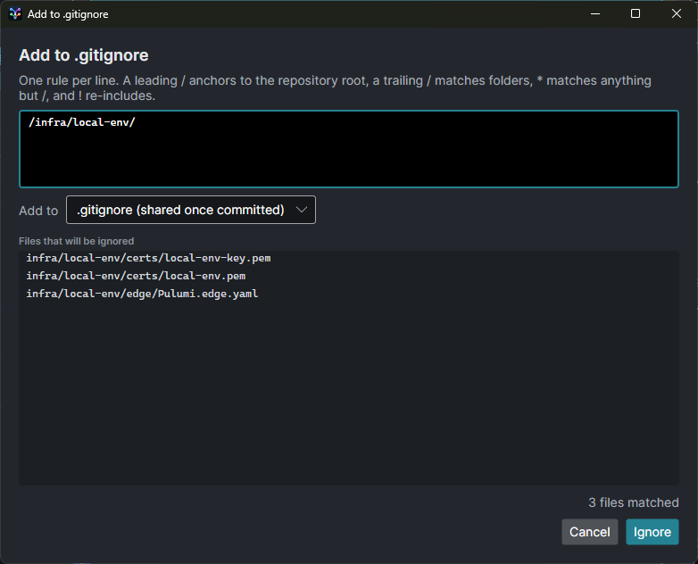

<h1 align="center">
  
</h1>

<p align="center">
  A visual git client for Windows, built with .NET and Avalonia.<br>
  <a href="https://totalgit.e-path.co.uk"><b>totalgit.e-path.co.uk</b></a> ·
  <a href="https://github.com/paulepath/total-git/releases/latest/download/TotalGitApp-win-Setup.exe">Download for Windows</a>
</p>



## Features

**The graph**
- **Commit graph** with coloured lanes, author avatars and resizable columns. When a commit has several
  branches or tags, each gets its own line.
- **Main lines drawn thicker**: whichever branches your branch rules mark as main lines (main, features, bugs…).
- **Fold commit runs**: consecutive commits on one line fold into a single "N commits" row; expand it with a click.
- **Filters**: show one developer's commits, or only the current branch's path back to main.
- **History search**: find loaded commits by message, SHA prefix or author, with previous/next matches. Search
  includes message bodies and says when more history remains to load.
- **Squash** a selection of commits into one, or **rebase** just the selected commits onto another branch.

**Branches**
- **Sidebar** of local and remote branches, tags, stashes and worktrees, with ahead/behind counts and a ✕ on
  branches whose remote branch has been deleted.
- **Branch rules**: icons and grouping by name pattern (`feature/`, `bug/`, `hot-fix/`…), with your own icons
  and colours, and which branches count as main lines.
- **Owners of remote branches**: each remote branch shows the avatar of whoever wrote most of its own commits
  (or its pull request's author).
- **Jira keys** in branch names are highlighted, and the right-click menu opens the ticket.
- **Delete branches from the remote**, with a warning when a pull request uses the branch.

**Reviews**
- **Pull requests** (GitHub) in the sidebar, grouped into Needs your review, Yours, Others and Drafts, with
  checks, review state and the ticket each one is for.
- **A review window for each pull request**: the files in a tree, one file at a time, a box to tick on each
  (kept in sync with GitHub's Viewed), line comments and submitting your review.
- **What changed since you reviewed**: files you'd ticked show as part-reviewed when they change, with the new
  lines marked, and "Only what changed since my last review" shows just those.
- **Local reviews**, before there's a pull request: review a branch against the branch it came off, or a run of
  selected commits, in the same window.
- Keyboard flow (N/P next file, J/K next change, R mark reviewed and go on), hide tests and generated files to
  review later, and one commit at a time.

**Everyday git**
- **Diffs** inline or side by side, with the whole file when you want it, for commits and uncommitted changes.
- **Ignore whitespace** in working, staged, commit and review diffs; the preference is remembered.
- **Staging and commit** with changed files in a collapsible folder tree (or a flat list) and a filter, plus
  fetch, pull and push.
- **Amend the last commit**, with its message prefilled and a warning if it has already been pushed. Also works
  without staged changes; unavailable before the first commit or during an operation.
- **Undo discarded changes**, including untracked files and their staging state. Backups live in the worktree's
  git directory for up to seven days (last 20 discards), including checkout discards and hard resets. Undo stops
  if affected paths have newer edits. Only changed files are backed up; a submodule keeps just its recorded commit.
- **Merge and rebase** from the right-click menu, including **interactive rebase** (reorder, reword, squash,
  fix up or drop commits).
- **Built-in 3-pane merge tool** for conflicts, with continue / skip / abort for merges and rebases in progress.
- **Add to .gitignore** from a right-click on a file or folder: edit the rule and see which files it will hide.
- **Stashes** and **tags** (annotated or lightweight, push and delete).
- **GitHub Actions** runs in the sidebar as they happen, with re-run and cancel.

**Tabs and worktrees**
- **Tabs** for several repositories or worktrees at once, restored when you reopen the app. Give a
  repository's tabs a colour, an icon and a name of their own.
- **A new tab** shows tiles of the repositories you've opened before, with their current branch.
- **Worktrees** under `.worktrees/<name>`, opened in a tab, in VS Code or in Visual Studio.

| Reviewing changes | Recent repositories and coloured tabs |
| --- | --- |
|  |  |

| Side-by-side diff | Staging and commit |
| --- | --- |
|  |  |

| Resolving a merge conflict | Interactive rebase |
| --- | --- |
|  |  |

Right-click a changed file or folder to add it to `.gitignore`, with a live list of what the rule hides:



<sub>Screenshots use a made-up demo repository and people.</sub>

## Install

Download **`TotalGitApp-win-Setup.exe`** from the [latest release](https://github.com/paulepath/total-git/releases/latest)
and run it. It installs for the current user (no admin) and adds a Start-menu shortcut.

The build isn't code-signed yet, so on first install Windows SmartScreen may show
"Windows protected your PC". Choose **More info → Run anyway**.

Requires [git](https://git-scm.com/) on `PATH` (used for commits, fetch/pull/push, merge, rebase, stash, tags and worktrees).
Pull requests and Actions need the repository to be on GitHub; everything else works with any remote.

## Updates

Every push to `master` that changes the app is built by GitHub Actions and published as a release (`v0.3.<run>`).
The installed app checks for a new release at start-up and every few hours, downloads it in the
background, and shows an **Update** button. Restart to apply it, or it's applied when you next close the app.

## Build from source

```
dotnet build
dotnet test
dotnet run --project src/TotalGit.App -- <path to a repository>
```

## Website

[totalgit.e-path.co.uk](https://totalgit.e-path.co.uk) is the static site in `site/`, hosted on an Azure Static
Web App (Free) with DNS in Cloudflare:

- `infra/` is the Pulumi program for both. The **Infrastructure** workflow previews changes on every push; run it
  by hand with `apply` to make them.
- The **Website** workflow publishes `site/` whenever it changes.
- `python tools/make_site_images.py` rebuilds the site's images from `docs/screenshots` and the app icon.
